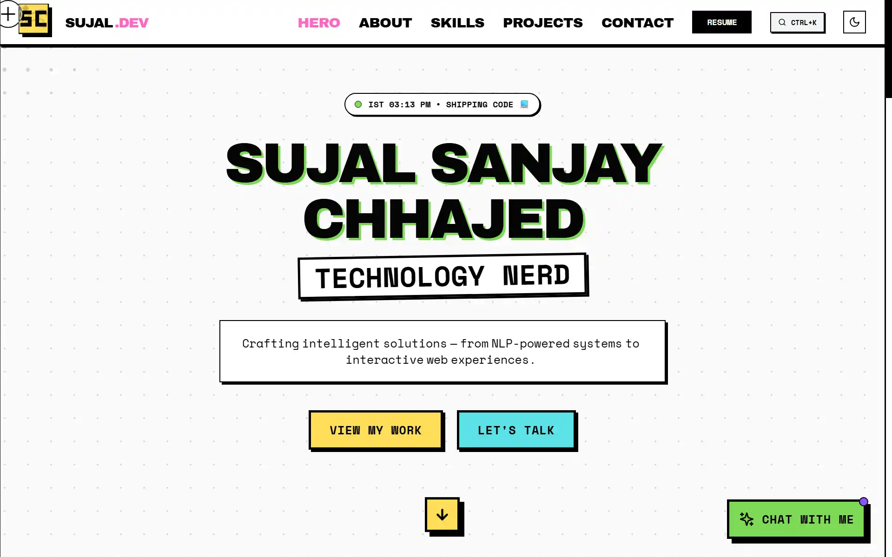

<h1 align="center">
  <br>
  ⚡ SUJAL.DEV
  <br>
  <sub>NEO-BRUTALIST AI PORTFOLIO</sub>
</h1>

<p align="center">
  
</p>

<p align="center">
  <b>TECH NERD WITH A HUMAN TOUCH</b>
</p>

<p align="center">
  <code>LOUD COLORS</code> · <code>HARD BORDERS</code> · <code>ZERO BLUR</code> · <code>BUILT TO MATCH THE SITE</code>
</p>

<p align="center">
  <a href="https://sujal-chhajed.vercel.app/">
    
  </a>
  &nbsp;
  <a href="LICENSE.txt">
    
  </a>
</p>

<br>

> **BRUTALISM CHECKLIST:**  
> ✓ Thick lines · ✓ Flat fills · ✓ Honest pixels · ✓ Tactile shadows · ✗ Blur

---

<br>

## `01` ABOUT

```
┌─────────────────────────────────────────────────────────────────────────────┐
│  SUJAL SANJAY CHHAJED                                                       │
│  ─────────────────────────────────────────────────────────────────────────  │
│  CS & ENGINEERING @ VIT CHENNAI                                             │
│  SPECIALIZATION: ARTIFICIAL INTELLIGENCE & MACHINE LEARNING                 │
│                                                                             │
│  I build things that feel alive on the web.                                 │
└─────────────────────────────────────────────────────────────────────────────┘
```

Code-blooded sports junkie. Ferrari in F1, cricket strategy, and Dragon Ball Z reruns fuel my dev sprints. I build with personality so the tech never feels sterile.

| | |
|:--|:--|
| **📍 LOCATION** | Chennai, India |
| **🎓 FOCUS** | NLP, Computer Vision, Interactive Web |
| **🏎️ VIBES** | F1 (Ferrari), Cricket, Anime |

---

<br>

## `02` CAPABILITIES

> A Neo-Brutalist portfolio that **rejects minimalism**: bold fills, hard borders, raw typography. Under the hood—React + TypeScript with an AI assistant routed through a backend proxy.

<br>

**🤖 GEMINI-POWERED CHAT ASSISTANT**  
Talk to an AI twin that answers questions about me using portfolio data and, when needed, a fresh look at GitHub activity.

**🧠 PERSONA + CONTEXT**  
Responses are guided by a curated context string (bio, projects, socials, interests) to keep the tone consistent.

**⌨️ COMMAND PALETTE (CMD+K)**  
Keyboard-first navigation designed for builders who hate hunting through menus.

**⚡ MOTION WITHOUT JANK**  
Animations stay smooth—`requestAnimationFrame`-driven where needed, minimal reflows.

**🎨 NEO-BRUTALIST SYSTEM**  
Hard borders, offset shadows, high-contrast colors, and type that doesn't whisper.

**📱 RESPONSIVE + ACCESSIBLE**  
Mobile-ready layout with touch-friendly UI and ARIA labels where they matter.

---

<br>

## `03` ARCHITECTURE

```
                           ┌─────────────────────┐
                           │     VISITOR UI      │
                           └──────────┬──────────┘
                                      │
                    (1) userMessage + portfolio context
                                      │
                                      ▼
            ┌─────────────────────────────────────────────────────┐
            │  POST /api/gemini                                   │
            │  https://gemini-backend-portfolio.vercel.app        │
            │  body: { userMessage, context }                     │
            └──────────────────────────┬──────────────────────────┘
                                       │
                    (2) Proxy calls Gemini (server-side creds)
                                       │
                                       ▼
                           ┌─────────────────────┐
                           │  { text, sources? } │
                           └─────────────────────┘
```

<br>

| FRONTEND | BACKEND PROXY |
|:---------|:--------------|
| Calls proxy from `services/geminiService.ts` | Owns secrets & handles rate limiting |
| Sends `userMessage` (visitor input) | Returns `text` (final answer) |
| Sends `context` (portfolio + tone) | Returns `sources?` (optional citations) |

<br>

**WHY A PROXY?**

| | |
|:--|:--|
| **🔒 SECURITY** | API keys stay server-side—never shipped to the client. |
| **🎛️ CONTROL** | Rate limiting + a consistent request/response shape. |
| **🔄 UPGRADES** | Swap Gemini versions without rewriting the frontend. |
| **🆕 FRESHNESS** | When asked about "latest work," the assistant checks my GitHub activity. |

---

<br>

## `04` TECH STACK

| CATEGORY | DETAILS |
|:---------|:--------|
| **Framework** | React 18 + Vite |
| **Language** | TypeScript (strict mode) |
| **Styling** | Tailwind CSS (custom theme) |
| **Motion** | Framer Motion + CSS keyframes |
| **Icons** | Lucide React |

<p align="left">
  
  
  
  
  
</p>

---

<br>

## `05` RUN IT LOCALLY

**Prerequisites:** Node.js v18+ and npm.

```bash
git clone https://github.com/Dragonballsuper-1995/my-portfolio.git
cd my-portfolio
npm install
npm run dev
```

```
┌──────────────────────────────────────────┐
│  🚀  OPEN: http://localhost:5173         │
└──────────────────────────────────────────┘
```

<br>

| SCRIPT | DESCRIPTION |
|:-------|:------------|
| `npm run dev` | Start dev server |
| `npm run build` | Type-check + production build |
| `npm run preview` | Preview built app |

---

<br>

## `06` LESSONS LEARNED

> **HARD TRUTHS FROM THE TRENCHES**

- **Prompt Engineering** — Personality constraints matter as much as factual context.  
- **Design Systems** — Neo-Brutalism needs rules (borders, shadows, contrast), or it becomes chaos.  
- **Performance** — Animation must earn its cost; prefer lightweight primitives and avoid re-render storms.  
- **Security** — Keep secrets server-side; the client stays clean.

---

<br>

## `07` CONTACT

<p align="center">
  <a href="mailto:sujalchhajed925@gmail.com">
    
  </a>
</p>

<p align="center">
  <a href="https://github.com/Dragonballsuper-1995"></a>
  &nbsp;
  <a href="https://www.linkedin.com/in/sujalchhajed925/"></a>
  &nbsp;
  <a href="https://www.instagram.com/sujalchhajed925/"></a>
  &nbsp;
  <a href="https://x.com/sujal_chhajed"></a>
</p>

---

<p align="center">
  <b>BUILT WITH 💻, ☕, AND FERRARI HOPE.</b>
</p>
