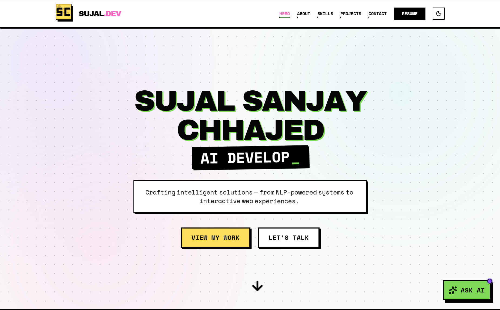

# ⚡ SUJAL.DEV | Neo-Brutalist AI Portfolio


> **"Tech Nerd with a Human Touch."**

[](https://sujal-chhajed.vercel.app/)

Welcome to the digital playground of **Sujal Sanjay Chhajed**, an **AI Developer & ML Engineer** based in Chennai, India. 

This isn't your standard, polished corporate portfolio. This is **Neo-Brutalism** met with **State-of-the-Art AI**. Built with bold borders, hard shadows, and high-contrast aesthetics, this site reflects my approach to code: robust, functional, and unapologetically distinct.

Integrates **Google Gemini 2.5** to power a context-aware AI Assistant that knows my resume better than I do.

---

## 👨‍💻 About The Developer

I am a Computer Science & Engineering student at **VIT Chennai** with a serious passion for **Machine Learning**, **NLP**, and **Data Science**. When I'm not training models or fine-tuning hyperparameters, I'm analyzing F1 strategies, debating Dragon Ball power levels, or hunting for the best street food in town.

*   **Role**: AI Developer & ML Engineer
*   **Location**: Chennai, India
*   **Tagline**: "Crafting intelligent solutions — from NLP-powered systems to interactive web experiences."

---

## 🚀 Key Features

### 🎨 Neo-Brutalist Design System
The UI follows a strict **Neo-Brutalist** design philosophy:
*   **Raw & Bold**: 4px hard borders, raw typography (`Space Mono` + `Archivo Black`), and vibrant accent colors (Neo-Yellow `#FFDE59`, Neo-Pink `#FF66C4`, Neo-Green `#7ED957`).
*   **Performance Animations**:
    *   **Off-Main-Thread Grid**: A dynamic background dot-grid calculated via a Web Worker to ensure 60FPS scrolling.
    *   **GPU Acceleration**: Heavy use of `transform` and `opacity` for butter-smooth interaction.
    *   **Custom Cursor**: A trailing crosshair cursor that reacts to interactive elements.

### 🤖 Gemini AI Assistant (RAG-Lite)
Click the floating **"Ask AI"** button to chat with my digital twin.
*   **Context-Aware**: The AI is fed a structured context of my resume, skills (`Python`, `TensorFlow`, `React`), and project history.
*   **Google Search Grounding**: Powered by Gemini 2.5, the assistant can browse the web to find my latest GitHub contributions or verify technical facts in real-time.
*   **Personality**: Configured to be professional yet witty, matching my personal interests (F1, Anime, Tech).

### ⚡ Interactive Projects Gallery
*   **Dynamic Filtering**: Filter projects by category (AI/ML, Web Dev, Data Science) without layout shifts.
*   **Color-Coded**: Projects are assigned specific "shadow colors" based on their ID (e.g., the *YouTube Title Generator* always glows **Pink**).

---

## 🛠️ Tech Stack

This project leverages the latest in modern web development:

| Domain | Technologies |
| :--- | :--- |
| **Frontend Framework** | **React 19** (Concurrent Features) |
| **Styling** | **Tailwind CSS** (Custom Config) |
| **Language** | **TypeScript** (Strict Type Safety) |
| **AI / LLM** | **Google Gemini API** (`gemini-2.5-flash`) |
| **Icons** | **Lucide React** |
| **Build Tool** | **Vite** (implied via fast refresh) |

---

## 🔧 Installation & Setup

1.  **Clone the repository**:
    ```bash
    git clone https://github.com/Dragonballsuper-1995/my-portfolio.git
    cd my-portfolio
    ```

2.  **Install Dependencies**:
    ```bash
    npm install
    ```

3.  **Configure Environment**:
    *   Create a `.env` file in the root directory.
    *   Add your Google Gemini API Key (Required for the Chatbot):
    ```env
    API_KEY=your_google_api_key_here
    ```

4.  **Run Development Server**:
    ```bash
    npm start
    ```

## 📝 Customization

This portfolio is built to be your own.

1.  **Update Personal Data**: Navigate to `src/constants.ts`. This file serves as the single source of truth for the entire site (Name, Bio, Projects, Skills).
2.  **Tweak the AI**: Open `src/services/geminiService.ts` and modify the `PORTFOLIO_CONTEXT` string to change the AI's system instructions and personality.
3.  **Change Colors**: The Neo-Brutalist palette is defined in `tailwind.config` inside `index.html`. Modify `colors.neo` to change the theme.

---

## 📬 Contact Me

*   **Email**: [sujalchhajed925@gmail.com](mailto:sujalchhajed925@gmail.com)
*   **LinkedIn**: [Sujal Sanjay Chhajed](https://www.linkedin.com/in/sujalchhajed925/)
*   **GitHub**: [Dragonballsuper-1995](https://github.com/Dragonballsuper-1995/)

---
*Designed & Developed by Sujal Sanjay Chhajed. © 2025*
