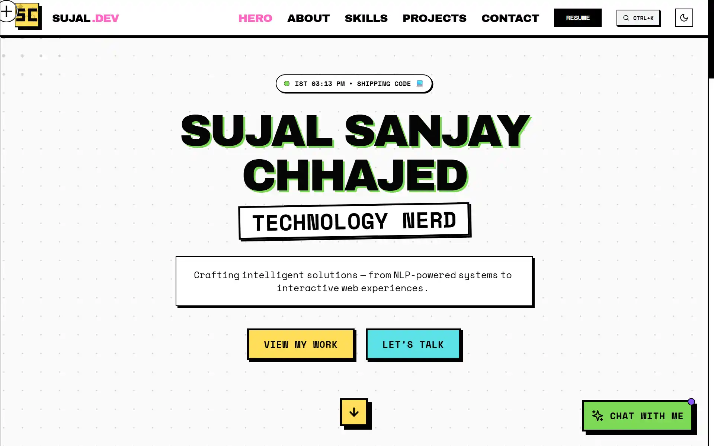

# ⚡ SUJAL.DEV | Neo-Brutalist AI Portfolio

Tech Nerd with a Human Touch

Loud colors. Hard borders. Zero blur. Built to match the site.

Brutalism checklist: thick lines, flat fills, honest pixels, tactile shadows — no blur.

---

01 / About

Hi, I'm <strong>Sujal Sanjay Chhajed</strong>, a Computer Science &amp; Engineering student at <strong>VIT Chennai</strong>, specializing in <strong>Artificial Intelligence &amp; Machine Learning</strong>. I build things that feel alive on the web.

I'm a code-blooded sports junkie: Ferrari in F1, cricket strategy, and Dragon Ball Z reruns fuel my dev sprints. I build with personality so the tech never feels sterile.

<ul style="margin:10px 0 0 18px;line-height:1.6;font-size:15px;color:#050505;">
<li><strong>📍 Location</strong>: Chennai, India</li>
<li><strong>🎓 Focus</strong>: NLP, Computer Vision, Interactive Web Experiences</li>
<li><strong>🏎️ Vibes</strong>: F1 (Ferrari), Cricket, Anime</li>
</ul>

02 / Capabilities

A Neo-Brutalist portfolio that rejects minimalism: bold fills, hard borders, and raw typography. Under the hood, it's a modern React + TypeScript app with an AI assistant routed through a backend proxy.

<table style="width:100%;border-collapse:separate;border-spacing:10px;margin-top:8px;">
<tr>
<td style="width:50%;vertical-align:top;padding:12px;border:3px solid #050505;background:#FFDE59;box-shadow:6px 6px 0 #050505;font-size:14px;line-height:1.5;color:#050505;">
<strong>🤖 Gemini-Powered Chat Assistant</strong> Talk to an AI twin that answers questions about me using portfolio data and, when needed, a fresh look at GitHub activity.
</td>
<td style="width:50%;vertical-align:top;padding:12px;border:3px solid #050505;background:#FFFFFF;box-shadow:6px 6px 0 #050505;font-size:14px;line-height:1.5;color:#050505;">
<strong>🧠 Persona + Context</strong> Responses are guided by a curated context string (bio, projects, socials, interests) to keep the tone consistent.
</td>
</tr>
<tr>
<td style="width:50%;vertical-align:top;padding:12px;border:3px solid #050505;background:#9AE6B4;box-shadow:6px 6px 0 #050505;font-size:14px;line-height:1.5;color:#050505;">
<strong>⌨️ Command Palette (Cmd+K)</strong> Keyboard-first navigation designed for builders who hate hunting menus.
</td>
<td style="width:50%;vertical-align:top;padding:12px;border:3px solid #050505;background:#FF66C4;box-shadow:6px 6px 0 #050505;font-size:14px;line-height:1.5;color:#050505;">
<strong>⚡ Motion Without Jank</strong> Animations and effects are built to stay smooth (requestAnimationFrame-driven where needed, minimal reflows).
</td>
</tr>
<tr>
<td style="width:50%;vertical-align:top;padding:12px;border:3px solid #050505;background:#FAFAFA;box-shadow:6px 6px 0 #050505;font-size:14px;line-height:1.5;color:#050505;">
<strong>🎨 Neo-Brutalist System</strong> Hard borders, offset shadows, high-contrast colors, and type that doesn’t whisper.
</td>
<td style="width:50%;vertical-align:top;padding:12px;border:3px solid #050505;background:#FFF5E6;box-shadow:6px 6px 0 #050505;font-size:14px;line-height:1.5;color:#050505;">
<strong>📱 Responsive + Accessible</strong> Mobile-ready layout with touch-friendly UI and ARIA labels where they matter.
</td>
</tr>
</table>

03 / Architecture

This repo is the <strong>frontend</strong> (React + Vite). AI requests are routed through a <strong>backend proxy</strong> so secrets never hit the browser and the API surface stays stable.

REQUEST FLOW (SEQUENCE)

<pre style="margin:8px 0 0 0;font-family:'Space Mono','Courier New',monospace;font-size:13px;line-height:1.6;color:#050505;">Visitor UI
	│
	├─(1) userMessage + portfolio context
	│
	├─(2) POST https://gemini-backend-portfolio.vercel.app/api/gemini
	│        body: { userMessage, context }
	│
	├─(3) Proxy calls Gemini (server-side credentials)
	│
	└─(4) UI receives { text, sources? }</pre>

<table style="width:100%;border-collapse:separate;border-spacing:10px;margin-top:10px;">
<tr>
<td style="width:50%;vertical-align:top;padding:12px;border:3px solid #050505;background:#FFFFFF;box-shadow:6px 6px 0 #050505;color:#050505;line-height:1.6;">
<strong>Frontend</strong> 
Calls the proxy from <code>services/geminiService.ts</code> and sends:
<ul style="margin:8px 0 0 18px;line-height:1.6;color:#050505;">
<li><code>userMessage</code> (visitor input)</li>
<li><code>context</code> (curated portfolio + tone)</li>
</ul>
</td>
<td style="width:50%;vertical-align:top;padding:12px;border:3px solid #050505;background:#E0F2FE;box-shadow:6px 6px 0 #050505;color:#050505;line-height:1.6;">
<strong>Backend Proxy</strong> 
Owns secrets and handles rate limiting; returns:
<ul style="margin:8px 0 0 18px;line-height:1.6;color:#050505;">
<li><code>text</code> (final answer)</li>
<li><code>sources?</code> (optional citations/links)</li>
</ul>
</td>
</tr>
</table>

<strong>Why a proxy?</strong>
<ul style="margin:8px 0 0 18px;line-height:1.65;font-size:15px;color:#050505;">
<li><strong>Security</strong>: API keys stay server-side (never shipped to the client).</li>
<li><strong>Control</strong>: rate limiting + a consistent request/response shape.</li>
<li><strong>Upgrades</strong>: swap Gemini versions without rewriting the frontend.</li>
<li><strong>Freshness</strong>: when asked about “latest work”, the assistant is instructed to check my GitHub activity.</li>
</ul>

04 / Tech Stack

<table style="width:100%;border-collapse:collapse;">
<tr>
<td style="padding:10px;border:3px solid #050505;background:#FAFAFA;color:#050505;font-weight:800;">Framework</td>
<td style="padding:10px;border:3px solid #050505;background:#FFFFFF;color:#050505;">React 18 + Vite

</td>
</tr>
<tr>
<td style="padding:10px;border:3px solid #050505;background:#FAFAFA;color:#050505;font-weight:800;">Language</td>
<td style="padding:10px;border:3px solid #050505;background:#FFFFFF;color:#050505;">TypeScript (strict build pipeline)

</td>
</tr>
<tr>
<td style="padding:10px;border:3px solid #050505;background:#FAFAFA;color:#050505;font-weight:800;">Styling</td>
<td style="padding:10px;border:3px solid #050505;background:#FFFFFF;color:#050505;">Tailwind CSS (custom theme)

</td>
</tr>
<tr>
<td style="padding:10px;border:3px solid #050505;background:#FAFAFA;color:#050505;font-weight:800;">Motion</td>
<td style="padding:10px;border:3px solid #050505;background:#FFFFFF;color:#050505;">Framer Motion + CSS keyframes

</td>
</tr>
<tr>
<td style="padding:10px;border:3px solid #050505;background:#FAFAFA;color:#050505;font-weight:800;">Icons</td>
<td style="padding:10px;border:3px solid #050505;background:#FFFFFF;color:#050505;">Lucide React

</td>
</tr>
</table>

05 / Run It (Local)

Prerequisites: Node.js v18+ and npm. Then run:

<pre style="margin:0;font-family:'Space Mono','Courier New',monospace;font-size:13px;line-height:1.6;color:#050505;">git clone https://github.com/Dragonballsuper-1995/my-portfolio.git
cd my-portfolio
npm install
npm run dev</pre>

Open: http://localhost:5173

<strong>Scripts</strong>
<ul style="margin:8px 0 0 18px;line-height:1.6;font-size:14px;color:#050505;">
<li><code>npm run dev</code> — start dev server</li>
<li><code>npm run build</code> — type-check + production build</li>
<li><code>npm run preview</code> — preview built app</li>
</ul>

06 / Lessons (Hard Truths)

<ul style="margin:0 0 0 18px;line-height:1.65;font-size:15px;color:#050505;">
<li><strong>Prompt engineering</strong>: Personality constraints matter as much as factual context.</li>
<li><strong>Design systems</strong>: Neo-Brutalism needs rules (borders, shadows, contrast) or it becomes chaos.</li>
<li><strong>Performance</strong>: Animation must earn its cost; prefer lightweight primitives and avoid re-render storms.</li>
<li><strong>Security</strong>: Keep secrets server-side; the client stays clean.</li>
</ul>

07 / Contact

<a href="mailto:sujalchhajed925@gmail.com" style="text-decoration:none;color:#050505;">Email: sujalchhajed925@gmail.com</a>

Built with 💻, ☕, and Ferrari hope.

